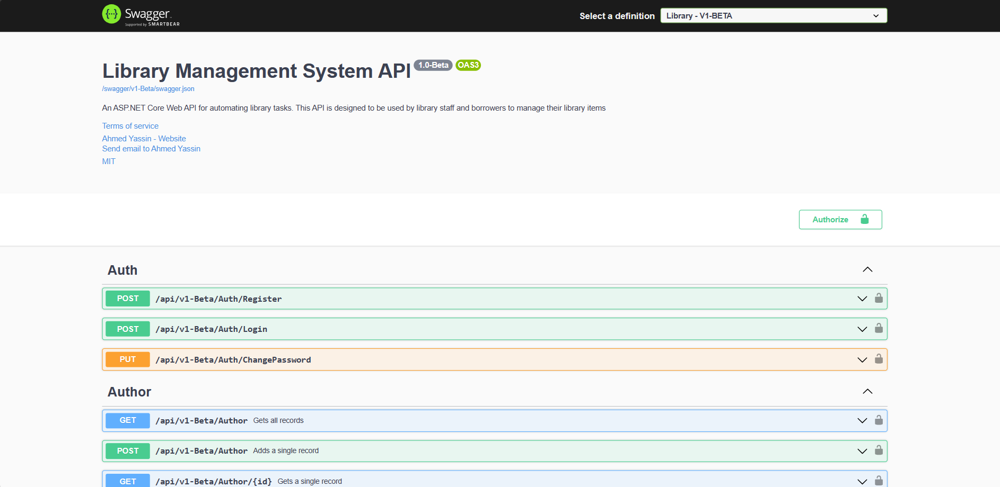
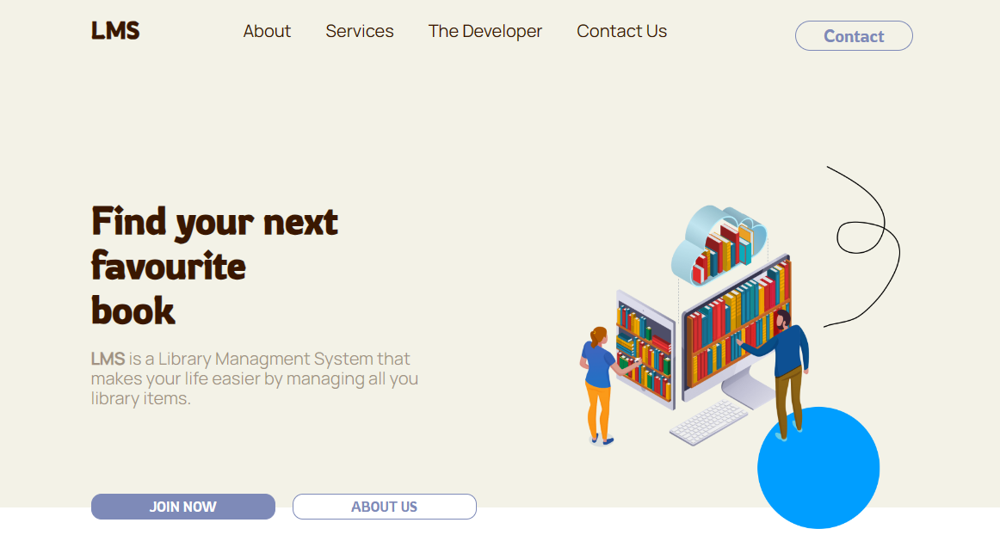

<a id="readme-top"></a>


<!-- PROJECT SHIELDS -->
[![MIT License][license-shield]][license-url]


<!-- PROJECT LOGO -->
<br />
<div align="center">
  <a href="https://github.com/CodeCollabHubA/Library-Management-System">
    
  </a>

  <h3 align="center">Library Management System</h3>

  <p align="center">
    A modern Library Management System for automating all library operations
    <br />
    <br />
    <a href="https://github.com/CodeCollabHubA/Library-Management-System">View Demo</a>
    ·
    <a href="https://github.com/CodeCollabHubA/Library-Management-System/issues/new?labels=bug&template=bug-report---.md">Report Bug</a>
    ·
    <a href="https://github.com/CodeCollabHubA/Library-Management-System/issues/new?labels=enhancement&template=feature-request---.md">Request Feature</a>
  </p>
    <br />
</div>


<!-- TABLE OF CONTENTS -->
<details>
  <summary>Table of Contents</summary>
  <ol>
    <li>
      <a href="#about-the-project">About The Project</a>
      <ul>
        <li><a href="#built-with">Built With</a></li>
      </ul>
    </li>
    <li>
      <a href="#getting-started">Getting Started</a>
    </li>
    <li><a href="#contributing">Contributing</a></li>
    <li><a href="#license">License</a></li>
    <li><a href="#contact">Contact</a></li>
  </ol>
</details>


<!-- ABOUT THE PROJECT -->
## About The Project

[![Product Name Screen Shot][product-screenshot]](https://example.com)
### Library Management System

Welcome to our Library Management System, a streamlined solution crafted with ASP.NET Core and React to modernize the way libraries operate. Designed for both library staff and borrowers, aiming to simplify the management of library resources.

#### Key Features:

* User Registration: Our system offers a seamless registration process, enabling users to quickly join and start utilizing library services.
* User Authentication: Secure login functionality ensures that user accounts are protected and transactions are safe.
* Manage Library Items: Easily add, update, or remove library items, keeping your collection up-to-date with minimal effort.
* Borrow and Return: Our intuitive borrowing and returning system makes it a breeze for users to check out and return books.

<p align="right">(<a href="#readme-top">back to top</a>)</p>


### Built With

#### Backend
* [![ASP.NET Core 7][.NET]][.NET-url]
* [![EF Core][EFCore]][EF-url]
  - [AutoMapper](https://github.com/AutoMapper/AutoMapper) handling Entity-to-DTO mapping
  - [Swagger UI](https://github.com/swagger-api/swagger-ui)

#### Frontend
* [![React][React.js]][React-url]
* [![Tailwind][Tailwind]][Tailwind-url]


<p align="right">(<a href="#readme-top">back to top</a>)</p>


<!-- GETTING STARTED -->
## Getting Started
**Prerequisites:**
1. Download and install the .NET Core SDK from [here](https://dotnet.microsoft.com/download).
2. Download and install SQL Server Express from [here](https://docs.microsoft.com/en-us/sql/database-engine/configure-windows/sql-server-express-localdb).
3. Download and install Node.js from [here](https://nodejs.org/en/download).


**Setup Instructions:**
1. Open a terminal such as PowerShell, Command Prompt, or bash.
2. Download the repo using the command below.
    ```sh
    curl -LJO https://github.com/CodeCollabHubA/Library-Management-System/archive/refs/heads/main.zip
    ```
3. Extract the .zip folder then navigate inside the project folder.
4. Start a terminal in the project folder and use the follwoing commands start the `Backend` server
      ```sh
      cd Backend/Library/Library.Api
      dotnet build
      dotnet run
      ```
5. Open your web browser and navigate to `http://localhost:5053/swagger/index.html` for Swagger UI.
  
6. Open new terminal on the project folder and run the following commands to start the `Frontend` development server :
    ```sh
    cd path/to/Frontend
    npm install
    npm start
    ```
8. The webpack dev server hosts the front-end, and your browser will automatically open to `http://localhost:3000`.



<!-- CONTRIBUTING -->
## Contributing

Contributions are what make the open source community such an amazing place to learn, inspire, and create. Any contributions you make are **greatly appreciated**.

If you have a suggestion that would make this better, please fork the repo and create a pull request. You can also simply open an issue with the tag "enhancement".
Don't forget to give the project a star! Thanks again!

1. Fork the Project
2. Create your Feature Branch (`git checkout -b feature/AmazingFeature`)
3. Commit your Changes, make sure to follow the [Conventional Commits specification](https://www.conventionalcommits.org/en/v1.0.0/) (`git commit -m 'feat(optional_scope): add some AmazingFeature'`)
4. Push to the Branch (`git push origin feature/AmazingFeature`)
5. Open a Pull Request

<p align="right">(<a href="#readme-top">back to top</a>)</p>


<!-- LICENSE -->
## License

Distributed under the MIT License. See `LICENSE.txt` for more information.

<p align="right">(<a href="#readme-top">back to top</a>)</p>


<!-- CONTACT -->
## Contact

[Ahmed Yassin](https://github.com/AhmedYassinH) | Backend Developer | [LinkedIn](https://www.linkedin.com/in/ahmed-yassinh/) | dev.ahmedyassin@gmail.com
[Mohammed Ismail](https://github.com/AhmedYassinH) | Frontend Developer | [LinkedIn](https://www.linkedin.com/in/mohammed-ismail-som3a/) | mrsom3a8@gmail.com
[Musab Obada](https://github.com/musabsamani) | Frontend Developer | [LinkedIn](https://linkedin.com/in/musabsamani) | me@elsamani.com


<p align="right">(<a href="#readme-top">back to top</a>)</p>


<!-- MARKDOWN LINKS & IMAGES -->
<!-- https://www.markdownguide.org/basic-syntax/#reference-style-links -->
[license-shield]: https://img.shields.io/github/license/othneildrew/Best-README-Template.svg?style=for-the-badge
[license-url]: https://github.com/CodeCollabHubA/Library-Management-System/blob/main/LICENSE

[product-screenshot]: images/screenshot.png
[React.js]: https://img.shields.io/badge/React-20232A?style=for-the-badge&logo=react&logoColor=61DAFB
[React-url]: https://reactjs.org/
[.NET]: https://img.shields.io/badge/ASP.NET%20Core%207-512BD4?style=for-the-badge&logo=.NET&logoColor=white
[.NET-url]: https://dotnet.microsoft.com/en-us/apps/aspnet/
[Tailwind]: https://img.shields.io/badge/Tailwind-38BDF8?style=for-the-badge&logo=tailwindcss&logoColor=white
[Tailwind-url]: https://tailwindui.com/
[EFCore]: https://img.shields.io/badge/EF%20Core%20-DC39AF?style=for-the-badge&logo=.NET&logoColor=white
[EF-url]: https://learn.microsoft.com/en-us/ef/core/

